# Informe Laboratorio 3: Transporte - Redes y Sistemas Distribuidos FaMAF

<br>

## Integrantes
- Gerbaudo, Nicolas Ignacio
- Jorge Gonzalez, Nicolas
- Ontivero, Nahuel Mauricio
- Vides, Alejo Miguel

<br>

## Resumen

En este laboratorio trabajamos con modelos de red simulados en OMNeT++, estudiando problemas de transporte en dos escenarios: **cuello de botella en el receptor** (Caso 1, problema de control de flujo) y **cuello de botella en la red** (Caso 2, problema de congestión). En la Parte 1, analizamos el comportamiento de buffers y tasas limitadas sin ningún mecanismo de control. En la Parte 2, implementamos un algoritmo de control inspirado en TCP, usando ventanas de congestión (`cwnd`) y recepción (`rwnd`) con feedback explícito de congestión (ECN binario), logrando eliminar la totalidad de los paquetes perdidos en ambos casos a costa de mayor latencia en el transmisor: el transmisor acumula paquetes en su buffer en lugar de enviarlos de golpe, entonces los paquetes esperan más antes de salir.

Las gráficas generadas se pueden encontrar en la carpeta `images`.

<br>

## Introducción

En este laboratorio se estudian dos problemas clásicos de la capa de transporte: control de flujo y control de congestión. Para ello se simulan dos escenarios con distinto cuello de botella.

En el **Caso 1**, el enlace más lento es el que conecta el buffer de recepción con el Sink (0.5 Mbps), mientras que la red opera a 1 Mbps. Esto provoca que el `rxBuffer` se sature: la red entrega paquetes más rápido de lo que el receptor puede consumirlos. Es un problema de **control de flujo**, ya que el emisor no tiene forma de saber que está desbordando al receptor.

En el **Caso 2**, el enlace más lento es el que conecta la cola intermedia con el receptor (0.5 Mbps), mientras que el emisor transmite a 1 Mbps. Esto provoca que la `queue` se sature: el tráfico supera la capacidad de la red. Es un problema de **control de congestión**, ya que el cuello de botella está en un recurso compartido de la red y no en el receptor.

<br>

## Métodos

El algoritmo usa 4 conceptos principales para controlar el flujo y la congestión: 

- La ventana de congestión (`cwnd`)
- La ventana de recepción (`rwnd`)
- El bit de congestión
- La ventana efectiva

El feedback se recibe por medio de los ACKs e incluye la información de congestión y el valor a asignarle a `rwnd`.

La ventana de congestión (`cwnd`) se inicializa por medio de un parámetro predefinido en `omnetpp.ini`. De ahí en adelante, con cada ACK el tamaño de la ventana aumenta en incrementos de `1/cwnd` por ACK. Al haber congestion (`ecnBit == true`), se divide la ventana a la mitad, siempre siendo 1 como mínimo.

```cpp
if (ecnBit == false) cwnd += 1.0 / cwnd;
else cwnd = std::max(1.0, cwnd / 2.0);
```

La ventana de recepción (`rwnd`) se inicializa con un valor grande por defecto hasta recibir el primer ACK. Luego, cada ACK actualiza el valor con `rwnd = ack->getRwnd();`.

Para detectar la congestión, un nodo intermedio marca el paquete con el `ecnBit` cuando la ocupación del buffer llega al 80% de su capacidad. El receptor copia este bit en el ACK y el transmisor ajusta los valores para acomodar el flujo.

```cpp
if (queueOccupation >= 0.8 * queueCapacity) {
    packet->setEcnBit(true);
}
```

`effectiveWindow` no se implementa como una variable explícita, sino que se utiliza `inFlight < std::min(cwnd, rwnd)` como la ventana efectiva.

La condición de envío es `while (!txBuffer.isEmpty() && inFlight < std::min(cwnd, rwnd))`. Es decir, si el buffer no esta vacío y la ventana efectiva no está llena, entonces el transmisor envía. De no cumplirse alguna de las condiciones, espera.

<br>

## Resultados

### Parte 1 - Comparación entre escenarios

En el Caso 1 tenemos un problema de control de flujo, donde el cuello de botella <u>ocurre en el receptor</u> (fuente limitante siendo el enlace **rxToSink**), se puede observar que la ocupación del buffer del receptor (`nodeRx`) se satura y, debido a la diferencia entre capacidades de flujo, queda saturado por el resto del funcionamiento del programa.

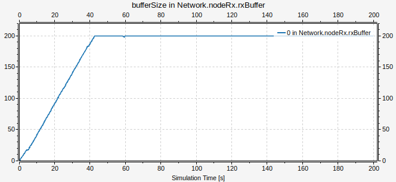

Mientras que la cola intermedia funciona sin atorarse.

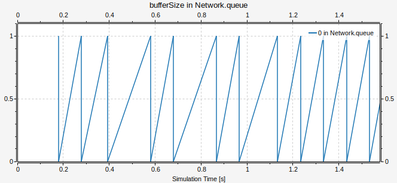

En el Caso 2, tenemos un problema de control de congestión, donde el cuello de botella <u>ocurre en la red</u> (fuente limitante siendo el enlace **queueToRx**) y se observa exactamente lo opuesto. Se satura la cola intermedia y el buffer del receptor funciona sin atascarse.

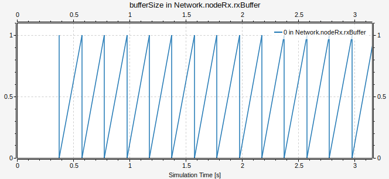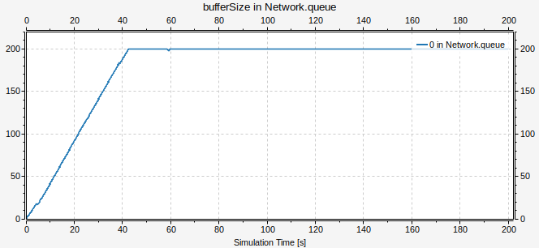

En ambos casos, el buffer de transmisión funciona de manera idéntica.


El fallo de control de flujo se produce al no evitar que el receptor sea saturado por un emisor demasiado rápido, y el fallo de control de congestión se produce al no evitar saturar la red. Hay gráficos adicionales con informacion tal como pérdidas de paquetes y carga ofrecida versus carga útil recibida en el directorio `./images`.

### Parte 2 - Comparaciones con/sin control

### Caso 1 (con gi=0.1)

#### Sin control de flujo

Para obtener estos resultados, ir al commit de la entrega parcial:

```sh
git switch --detach bc7afb1
```

Compilar y correr la simulación de **Caso 1** con **gi=0.1**.

- En `nodeTx.gen`:
    - `Generated packets == 1979`.
- En `nodeTx.txBuffer`:
    - `Dropped packets == 0` (por diseño de la red, en el transmisor nunca se dropean paquetes: su buffer es lo suficientemente grande).
    - `bufferSize == 8` cuando termina la simulación (i.e., quedan 8 paquetes en el buffer).
- En `queue`:
    - `Dropped packets == 0` (para este caso, no hay cuello de botella en la red).
- En `nodeRx.rxBuffer`:
    - `Dropped packets == 770`: **cuello de botella en el receptor**.
    - `bufferSize == 200` cuando termina la simulación.
- En `nodeRx.sink`:
    - `Number of packets == 998`.

El generador produce 1979 paquetes. De estos, 770 son descartados en el buffer del receptor y 998 llegan al sink, lo que deja 211 paquetes sin contabilizar. Al analizar el estado final de la simulación, vemos que:

- El buffer de transmisión (`txBuffer`) tiene 8 paquetes pendientes de envío.
- La cola intermedia (`queue`) tiene 0 paquetes y nunca acumula más de 1 durante la simulación, por lo que no retiene paquetes.
- El buffer del receptor (`rxBuffer`) tiene 200 paquetes: llegaron pero no alcanzaron a ser despachados al sink.
- Los 3 paquetes restantes probablemente se encontraban en tránsito en alguno de los canales de la red (`txBuffer` → `queue`, `queue` → `rxBuffer`) o en las conexiones internas de los nodos (`gen` → `txBuffer`, `rxBuffer` → `sink`).

En total: 998 + 770 + 200 + 8 + 3 = 1979.


*Ocupación del buffer del transmisor*


*Ocupación de la cola intermedia*


*Ocupación del buffer del receptor*

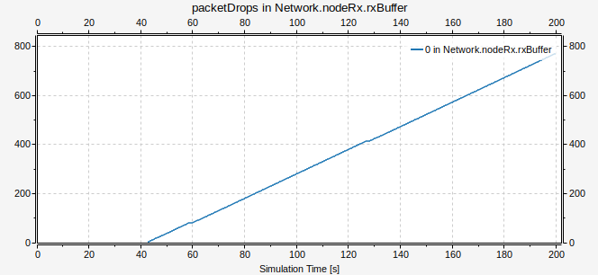
*Paquetes descartados en el buffer del receptor*


*Carga ofrecida*

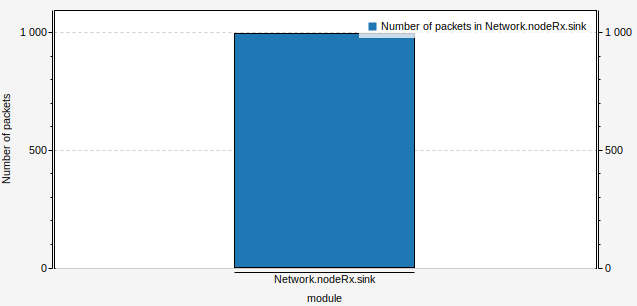
*Carga útil*

#### Con control de flujo

Estos resultados se obtienen en el commit de la entrega final, compilando y corriendo la simulación de **Caso 1** con **gi=0.1**.

- En `nodeTx.gen`:
    - `Generated packets == 1979`.
- En `nodeTx.transportTx`:
    - `bufferSize == 781` cuando termina la simulación.
- En `queue`:
    - `Dropped packets == 0` (para este caso, no hay cuello de botella en la red).
- En `nodeRx.transportRx`:
    - `Dropped packets == 0`: **funciona control de flujo**.
    - `bufferSize == 198` cuando termina la simulación.
- En `nodeRx.sink`:
    - `Number of packets == 998`.

El generador produce 1979 paquetes. De estos, 998 llegan al sink, lo que deja 981 paquetes sin contabilizar. Al analizar el estado final de la simulación, vemos que:

- El buffer de transmisión (`txBuffer`) tiene 781 paquetes pendientes de envío: el control de flujo frenó al transmisor, acumulando paquetes que no pudieron ser enviados.
- La cola intermedia (`queue`) tiene 0 paquetes y nunca acumula más de 1 durante la simulación, por lo que no retiene paquetes.
- El buffer del receptor (`rxBuffer`) tiene 198 paquetes: llegaron pero no alcanzaron a ser despachados al sink.
- Los 2 paquetes restantes probablemente se encontraban en tránsito en alguno de los canales de la red (`txBuffer` → `queue`, `queue` → `rxBuffer`) o en las conexiones internas de los nodos (`gen` → `txBuffer`, `rxBuffer` → `sink`).

En total: 998 + 781 + 198 + 2 = 1979.

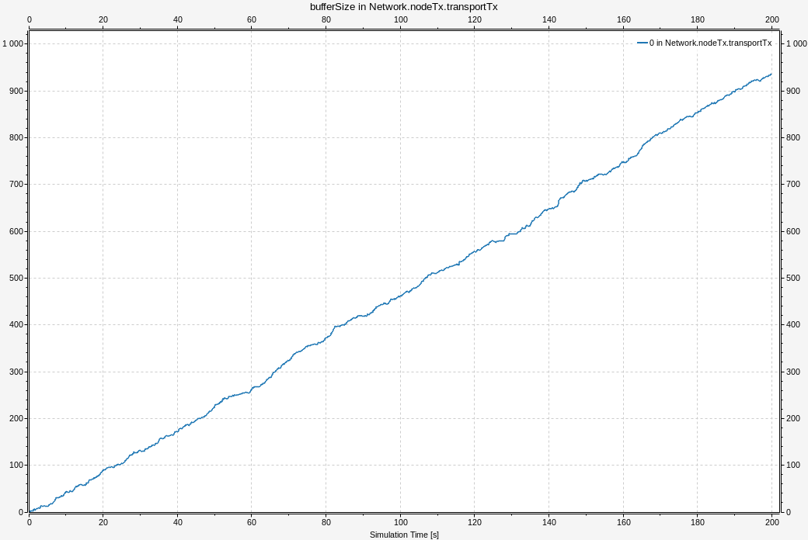
*Ocupación del buffer del transmisor*

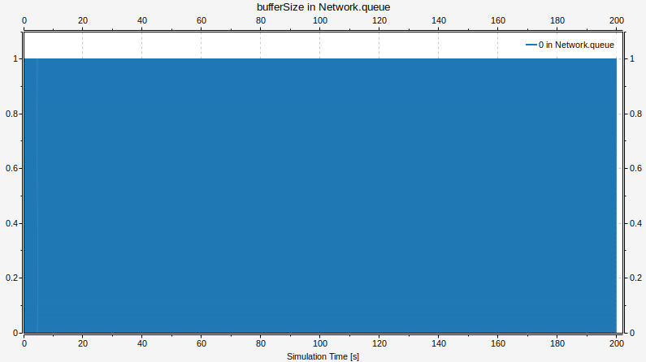
*Ocupación de la cola intermedia*

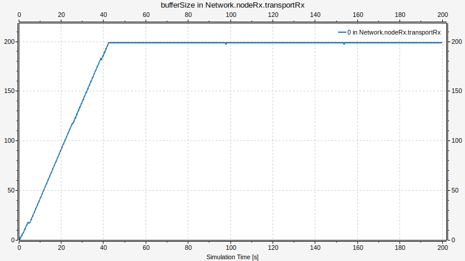
*Ocupación del buffer del receptor*

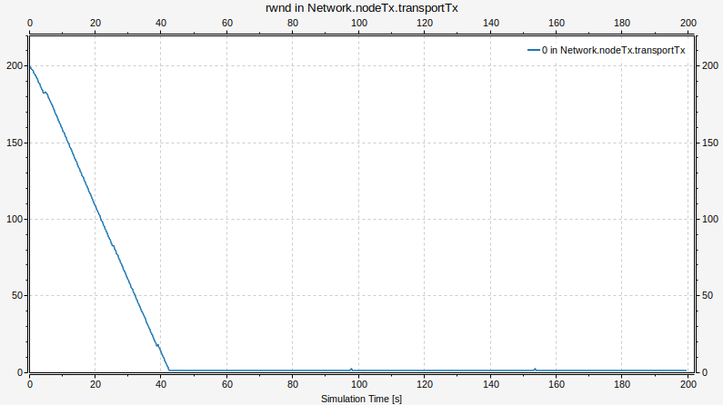
*rwnd*


*Carga ofrecida*


*Carga útil*

### Caso 2 (con gi=0.1)

#### Sin control de congestión

Para obtener estos resultados, ir al commit de la entrega parcial:

```sh
git switch --detach bc7afb1
```

Compilar y correr la simulación de **Caso 2** con **gi=0.1**.

- En `nodeTx.gen`:
    - `Generated packets == 1979`.
- En `nodeTx.txBuffer`:
    - `Dropped packets == 0` (por diseño de la red, en el transmisor nunca se dropean paquetes: su buffer es lo suficientemente grande).
    - `bufferSize == 8` cuando termina la simulación (i.e., quedan 8 paquetes en el buffer).
- En `queue`:
    - `Dropped packets == 771`: **cuello de botella en la red**.
- En `nodeRx.rxBuffer`:
    - `Dropped packets == 0` (para este caso, no hay cuello de botella en el receptor).
    - `bufferSize == 0` cuando termina la simulación.
- En `nodeRx.sink`:
    - `Number of packets == 998`.

El generador produce 1979 paquetes. De estos, 771 son descartados en la cola intermedia y 998 llegan al sink, lo que deja 210 paquetes sin contabilizar. Al analizar el estado final de la simulación, vemos que:

- El buffer de transmisión (`txBuffer`) tiene 8 paquetes pendientes de envío.
- La cola intermedia (`queue`) tiene 0 paquetes al finalizar.
- El buffer del receptor (`rxBuffer`) tiene 0 paquetes al finalizar: los paquetes que llegaron fueron despachados al sink sin acumulación.
- Los 202 paquetes restantes probablemente se encontraban en tránsito en alguno de los canales de la red (`txBuffer` → `queue`, `queue` → `rxBuffer`) o en las conexiones internas de los nodos (`gen` → `txBuffer`, `rxBuffer` → `sink`).

En total: 998 + 771 + 8 + 202 = 1979.

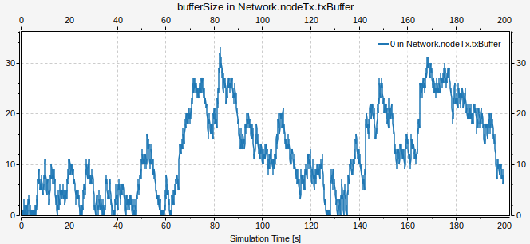
*Ocupación del buffer del transmisor*


*Ocupación de la cola intermedia*

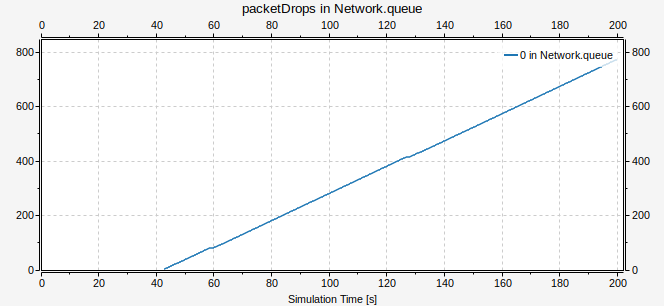
*Paquetes descartados en la cola intermedia*


*Ocupación del buffer del receptor*

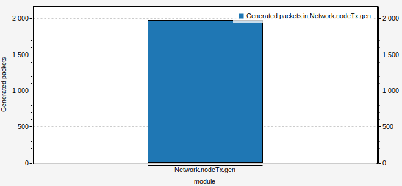
*Carga ofrecida*

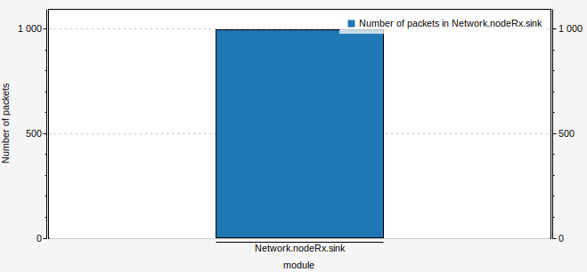
*Carga útil*


#### Con control de congestión

Estos resultados se obtienen en el commit de la entrega final, compilando y corriendo la simulación de **Caso 2** con **gi=0.1**.

- En `nodeTx.gen`:
    - `Generated packets == 1979`.
- En `nodeTx.transportTx`:
    - `bufferSize == 936` cuando termina la simulación.
    - `inFlight == 45` cuando termina la simulación.
- En `queue`:
    - `Dropped packets == 0`: **funciona control de congestión**.
- En `nodeRx.transportRx`:
    - `Dropped packets == 0` (para este caso, no hay cuello de botella en el receptor).
    - `bufferSize == 0` cuando termina la simulación.
- En `nodeRx.sink`:
    - `Number of packets == 998`.

El generador produce 1979 paquetes. De estos, ninguno es descartado en la red ni en el receptor, y 998 llegan al sink, lo que deja 981 paquetes sin contabilizar. Al analizar el estado final de la simulación, vemos que:

- El buffer de transmisión (`txBuffer`) tiene 936 paquetes pendientes de envío: el control de congestión frenó al transmisor, acumulando paquetes que no pudieron ser enviados por el cuello de botella en la red.
- Hay 45 paquetes en vuelo (`inFlight`): fueron enviados por `TransportTx` pero sus ACKs no llegaron antes de que terminara la simulación.
- La cola intermedia (`queue`) tiene 0 paquetes al finalizar y nunca acumula paquetes en exceso: el control de congestión evitó que se llenara.
- El buffer del receptor (`rxBuffer`) tiene 0 paquetes al finalizar: los paquetes que llegaron fueron despachados al sink sin acumulación.

En total: 998 + 936 + 45 = 1979.


*Ocupación del buffer del transmisor*

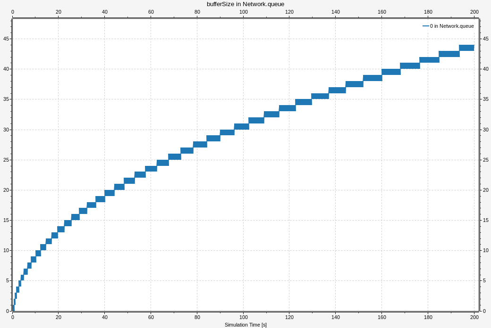
*Ocupación de la cola intermedia*

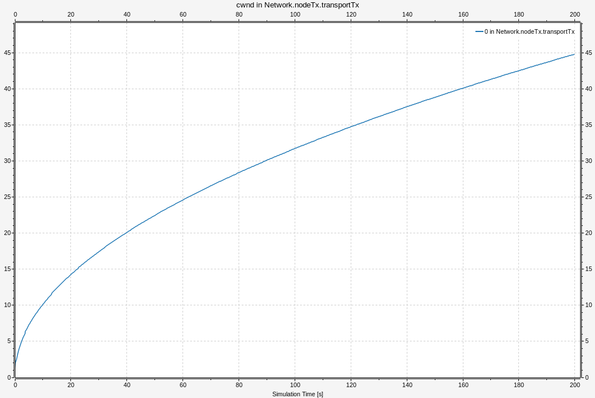
*cwnd*

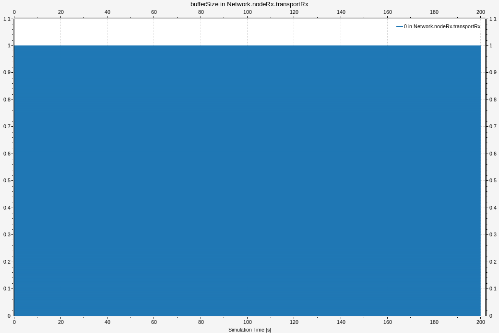
*Ocupación del buffer del receptor*


*Carga ofrecida*

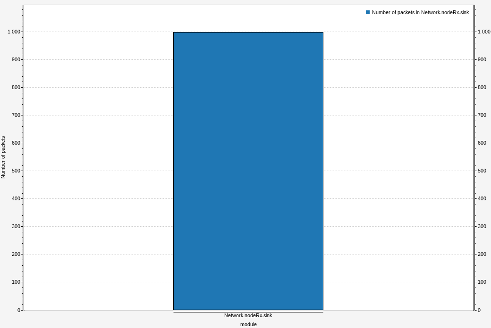
*Carga útil*

<br>

## Discusión

Logramos eliminar la totalidad de paquetes perdidos en ambos casos, pero el costo de nuestra solución es que se incrementa significativamente el buffering y la latencia del transmisor para evitar pérdidas en el receptor. Al reducir agresivamente la velocidad de envío frente a congestión y limitar la ventana efectiva, los paquetes permanecen más tiempo encolados antes de ser transmitidos.

Nuestro diseño tiene limitaciones como el expresar ECN como un binario duro, no implementar retransmisión por timeout ni detección de paquetes fuera de orden, y la acumulación indefinida en el buffer del transmisor cuando el enlace es el cuello de botella.

<br>

## Anexo IA

Las herramientas de inteligencia artificial se utilizaron de manera didáctica para recibir explicaciones, corroborar y obtener una segunda opinión, y también como un corrector sintáctico para el apartado teórico. Se utilizaron *ChatGPT* *Claude* y *Gemini*. Las respuestas y soluciones obtenidas fueron validadas observando el gráfico resultante de la simulación.

<br>

## Referencias

- [Material de la cátedra](https://www.google.com/)
- [Guía de instalación de OMNeT++ (zulip)](https://www.google.com/)

<br>

## Tabla de la competición

Comando para correr la simulación:
`./lab3-kickstarter -u Cmdenv -c Competicion`

Tabla de resultados:

| Grupo | goodput (pkt/s) | lossRate (%) | avgDelay (s) | stability (pkt) |
|-------|-----------------|--------------|--------------|-----------------|
| Grupo 25 | 4.985 | 0% | 6.067 | 10.614 |
